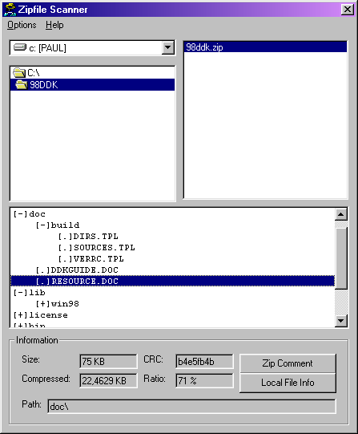

## ZipFileScanner

### Description

This program scans a zip archive and shows you all the files inside.
 
### More Info
 
Due to the zip file structure, this program only reads the standard structure.

             |
---                |---
**Submitted On**   |2001-10-09 23:58:20
**By**             |[Paul Guerra](https://github.com/Planet-Source-Code/PSCIndex/blob/master/ByAuthor/paul-guerra.md)
**Level**          |Intermediate
**User Rating**    |4.3 (13 globes from 3 users)
**Compatibility**  |VB 5\.0, VB 6\.0
**Category**       |[Complete Applications](https://github.com/Planet-Source-Code/PSCIndex/blob/master/ByCategory/complete-applications__1-27.md)
**World**          |[Visual Basic](https://github.com/Planet-Source-Code/PSCIndex/blob/master/ByWorld/visual-basic.md)
**Archive File**   |[ZipFileSca3169310292001\.zip](https://github.com/Planet-Source-Code/paul-guerra-zipfilescanner__1-12889/archive/master.zip)

